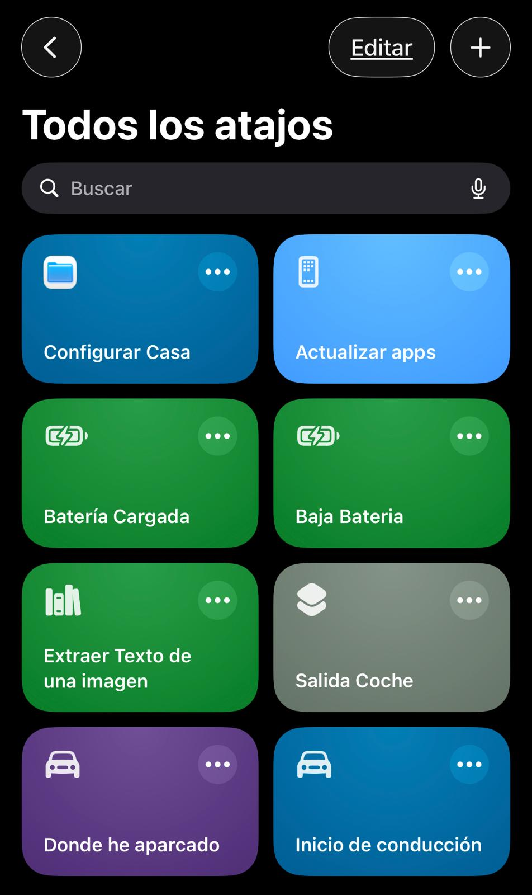
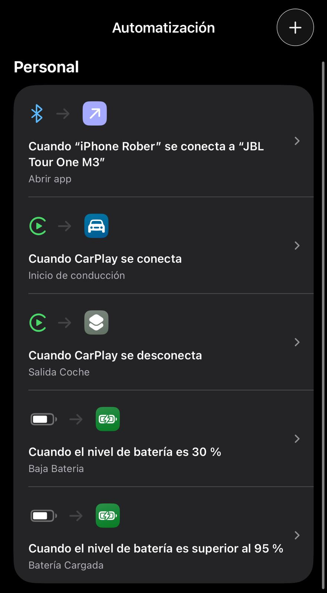

# 🚀 iOS Shortcuts & Automatizaciones

---

  

<h1 align="center">Automatiza tu iPhone sin apps externas</h1>

Sistema modular de atajos diseñado para ahorrar tiempo, eliminar tareas repetitivas y mejorar tu día a día.

---

## ⚡ Lo que puedes hacer

- ⚡ Automatizar tareas sin tocar el móvil  
- 🔁 Reducir acciones repetitivas  
- 🧠 Crear un sistema modular reutilizable  
- 🔐 Mantener todo 100% local y privado  
- 🚀 Escalar automatizaciones fácilmente  

---

## ⚙️ Cómo funciona

1. Configuras tu entorno (casa)  
2. Activas automatizaciones (coche, batería…)  
3. El sistema actúa automáticamente  

👉 Sin intervención manual en la mayoría de casos

---

## ⚡ Prueba rápida (1 minuto)

¿Quieres ver cómo funciona sin complicarte?

📍 **Dónde he aparcado**  
Guarda automáticamente la ubicación de tu coche al bajarte.

👉 📂 [Ver guía](./shortcuts/donde-he-aparcado/README.md)

---

## 🧱 Orden recomendado (IMPORTANTE)

Para que todo funcione correctamente:

1. 🏠 **Configurar casa**  
2. 🚗 Automatizaciones de coche  
3. 🔋 Automatizaciones de batería  
4. ⚙️ Utilidades  

---

## 🏠 Configuración inicial

### 🏠 Configurar casa

Este paso es obligatorio.

Guarda tu ubicación como referencia para el resto del sistema.

👉 📂 [Ver guía](./shortcuts/configurar-casa/README.md)

---

## 📦 Automatizaciones disponibles

### 🚗 Coche

- 🚗 **Salida coche**  
  Detecta cuando sales del coche y ejecuta acciones inteligentes  
  👉 📂 [Ver guía](./shortcuts/salida-coche/README.md)

- 🚗 **Inicio conducción (básico)**  
  Automatización simple al iniciar la marcha  
  👉 📂 [Ver guía](./shortcuts/inicio-conduccion/README.md)

- 🚀 **Inicio conducción V2 (IA + Voz)**  
  Asistente de conducción con generación de mensajes y voz natural  
  👉 📂 [Ver guía](./shortcuts/inicio-conduccion-v2/README.md)

- 📍 **Dónde he aparcado**  
  Guarda automáticamente la ubicación de aparcamiento  
  👉 📂 [Ver guía](./shortcuts/donde-he-aparcado/README.md)

---

### 🔋 Batería

- 🔋 **Batería baja**  
  Actúa cuando el nivel baja de cierto porcentaje  
  👉 📂 [Ver guía](./shortcuts/bateria-baja/README.md)

- 🔌 **Batería cargada**  
  Se ejecuta al superar un nivel de carga  
  👉 📂 [Ver guía](./shortcuts/bateria-cargada/README.md)

---

### ⚙️ Utilidades

- 🔊 **TTS Google (voz natural)**  
  Convierte cualquier texto en voz real usando Google Cloud Text-to-Speech  
  👉 📂 [Ver guía](./shortcuts/tts-google/README.md)

- 🔄 **Actualizar apps**  
  Abre la App Store en la sección de actualizaciones  
  👉 📂 [Ver guía](./shortcuts/actualizar-apps/README.md)

- 📄 **Extraer texto de imagen**  
  Obtiene texto desde una imagen  
  👉 📂 [Ver guía](./shortcuts/extraer-texto/README.md)

---

## 🧠 Arquitectura del sistema

Este proyecto no es solo una colección de atajos.

Es un sistema modular donde los atajos comparten información:

- 📁 Archivo de configuración (casa)  
- 📍 Datos de ubicación  
- 🔁 Lógica reutilizable  

👉 Permite automatizaciones más inteligentes y conectadas

---

## 🔗 Automatizaciones en iOS

  

Muchos atajos funcionan automáticamente mediante automatizaciones:

- 🔌 Nivel de batería → ejecuta un atajo  
- 🚗 CarPlay → ejecuta otro atajo  

👉 Cada atajo incluye su configuración

---

## ⚠️ Requisitos

- 📱 iOS 26.4.1 o superior  
- 📲 App Atajos actualizada  

---

## 🛠️ Problemas comunes

- ❌ No funciona → revisa permisos  
- ❌ No se ejecuta → revisa automatización  
- ❌ Ubicación incorrecta → vuelve a configurar casa  
- ❌ Algo falla → revisa el README del atajo  

---

## 🔐 Privacidad

- No se almacenan direcciones visibles  
- No se comparten datos  
- Todo se ejecuta en el dispositivo  

---

## 🤝 Contribuciones

Puedes adaptar estos atajos a tu flujo y mejorarlos.

---

## ⭐ Si te sirve...

Dale una estrella al repo 😉
