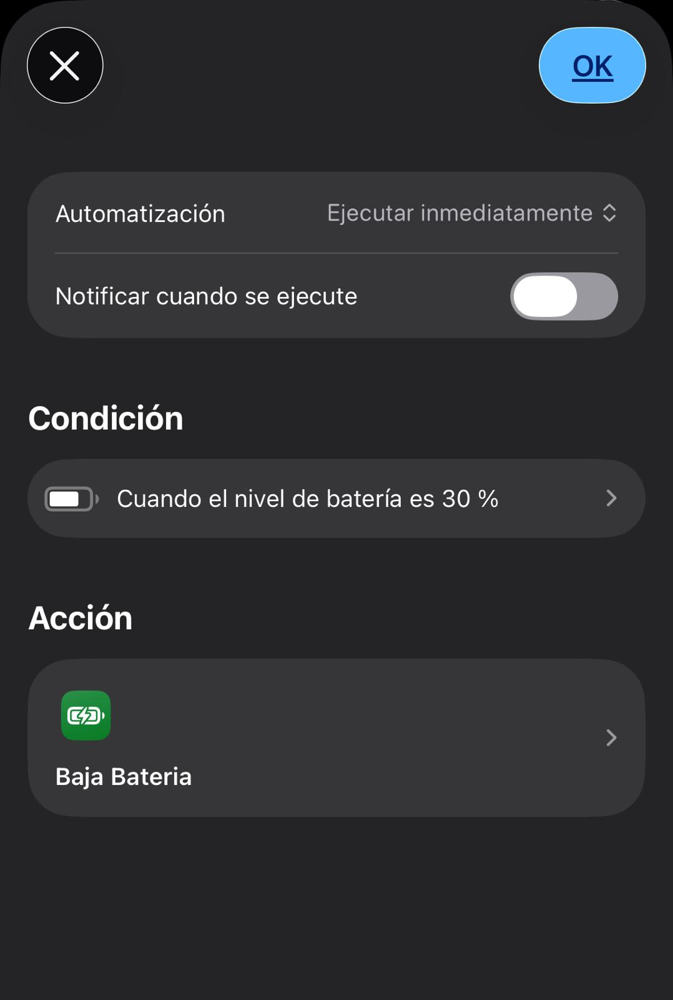

# 🔋 Modo batería baja automático

Ejecuta automáticamente un atajo cuando la batería baja de un porcentaje definido.

---

## 🧠 ¿Para qué sirve?

Este sistema te permite:

- Automatizar acciones cuando la batería está baja  
- Ahorrar energía sin intervención manual  
- Optimizar el uso del dispositivo  

Ideal para alargar la batería de forma automática.

---

## ⚙️ Requisitos

- 📱 iOS actualizado  
- 📲 App Atajos  

---

## 📲 Instalación

1. Descarga el atajo:  
   🔗 https://www.icloud.com/shortcuts/b6d32cc723574c659f0b57de6f0e0d57  

2. Ábrelo en la app **Atajos**

---

## ▶️ Uso

Este sistema no se ejecuta manualmente.

Funciona automáticamente mediante una automatización configurada por el usuario.

---

## 🤖 Automatización

Configura una automatización en iOS:

  

1. Abre **Atajos → Automatización**  
2. Pulsa **Crear automatización personal**  
3. Selecciona **Nivel de batería**  
4. Configura:
   - Baja de: `20%` (o el valor que prefieras)  
5. Pulsa **Siguiente**  
6. Añade acción:
   - Ejecutar atajo  
   - Selecciona: **Baja batería**  
7. Pulsa **Siguiente**  
8. Desactiva:
   - ❌ "Solicitar confirmación"  
9. Guardar  

---

## ⚙️ ¿Qué hace el atajo?

  

El atajo ejecuta automáticamente acciones de ahorro como:

- ⚡ Activar modo de bajo consumo  
- 🔅 Reducir brillo (ejemplo: 50%)  

👉 Puedes personalizar estas acciones según tus necesidades.

---

## 📂 ¿Qué hace internamente?

El sistema funciona en dos partes:

1. iOS detecta que la batería baja del porcentaje configurado  
2. Se ejecuta el atajo automáticamente  
3. El atajo aplica configuraciones de ahorro  

---

## ⚠️ Problemas comunes

- ❌ No se ejecuta → revisa la automatización  
- ❌ Pide confirmación → asegúrate de desactivarla  
- ❌ Algunas acciones no funcionan → puede depender de restricciones de iOS  

---

## 💡 Notas

- Puedes personalizar completamente el atajo  
- Añade más acciones según tu uso diario  

Ejemplos:

- 🔕 Activar modo No molestar  
- 📶 Desactivar conexiones  
- 🌙 Activar modo oscuro  

👉 Este sistema es totalmente adaptable a tu uso
