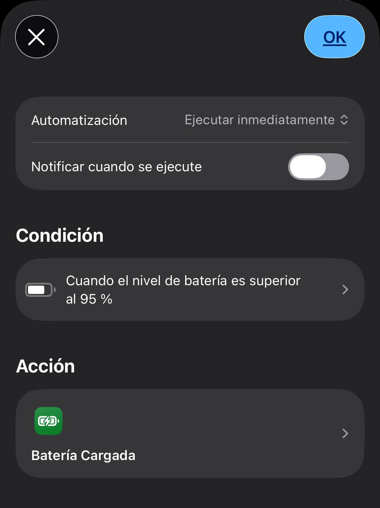
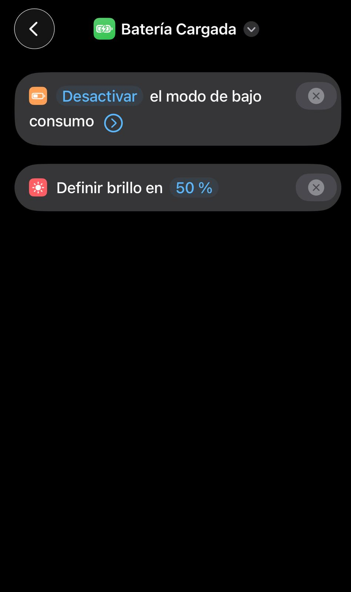

# 🔌 Restaurar estado al cargar batería

Ejecuta automáticamente un atajo cuando el dispositivo comienza a cargarse para restaurar el estado normal del sistema.

---

## 🧠 ¿Para qué sirve?

Este sistema te permite:

- Recuperar configuraciones normales tras el modo ahorro  
- Automatizar ajustes al empezar a cargar  
- Mejorar la experiencia sin intervención manual  

👉 Ideal para complementar **Modo batería baja automático**

---

## ⚙️ Requisitos

- 📱 iOS actualizado  
- 📲 App Atajos  
- 🔗 Dependencias (recomendado):
  - 🔋 Modo batería baja automático  

---

## 📲 Instalación

1. Descarga el atajo:  
   🔗 https://www.icloud.com/shortcuts/bd0d857ff96744479659f2056dd75532  

2. Ábrelo en la app **Atajos**

---

## ▶️ Uso

Este sistema no se ejecuta manualmente.

Funciona automáticamente cuando el dispositivo comienza a cargarse.

---

## 🤖 Automatización

Configura una automatización en iOS:

  

1. Abre **Atajos → Automatización**  
2. Pulsa **Crear automatización personal**  
3. Selecciona **Cargador**  
4. Configura:
   - 👉 **Está conectado**  
5. Pulsa **Siguiente**  
6. Añade acción:
   - Ejecutar atajo  
   - Selecciona: **Batería cargada**  
7. Pulsa **Siguiente**  
8. Desactiva:
   - ❌ "Solicitar confirmación"  
9. Guardar  

---

## ⚙️ ¿Qué hace el atajo?

  

El atajo restaura automáticamente configuraciones normales como:

- ⚡ Desactivar modo de bajo consumo  
- 🔆 Ajustar brillo (ejemplo: 50%)  

👉 Puedes personalizar estas acciones según tu uso.

---

## 📂 ¿Qué hace internamente?

El sistema funciona en dos partes:

1. iOS detecta que el dispositivo comienza a cargarse  
2. Se ejecuta el atajo automáticamente  
3. El atajo restaura configuraciones normales  

---

## ⚠️ Problemas comunes

- ❌ No se ejecuta → revisa la automatización  
- ❌ Pide confirmación → asegúrate de desactivarla  
- ❌ Algunas acciones no se aplican → puede depender de restricciones de iOS  

---

## 💡 Notas

- Puedes personalizar completamente el atajo  
- Añade más acciones según tus necesidades  

Ejemplos:

- 🔔 Desactivar modo No molestar  
- 📶 Activar WiFi / Bluetooth  
- 🌞 Ajustar brillo automáticamente  

👉 Este atajo complementa perfectamente el modo de batería baja

---

## 🔁 Relación con otros atajos

Este atajo complementa:

- 🔋 **Modo batería baja automático**

👉 Juntos permiten automatizar completamente el comportamiento de la batería
