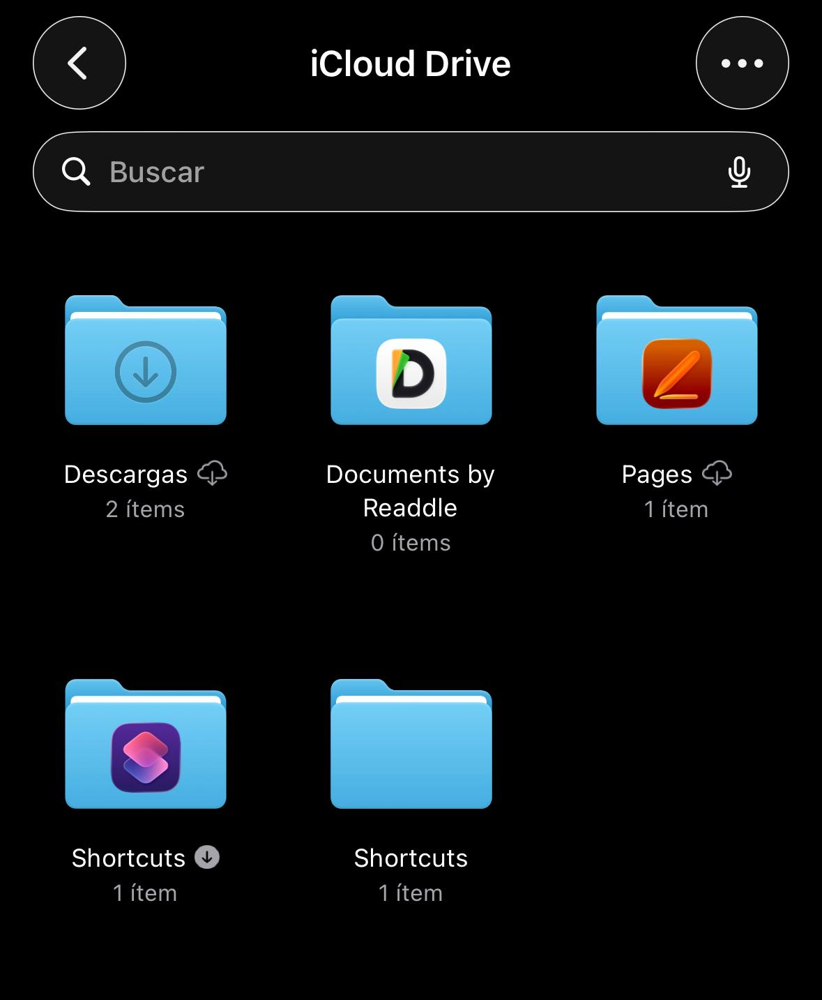
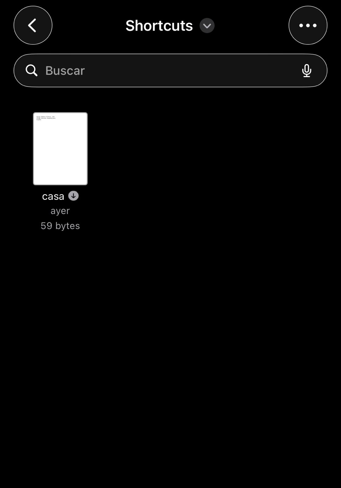

# 🏠 Configurar casa

Atajo necesario para inicializar el sistema de automatizaciones.

Guarda tu ubicación actual como referencia para otros atajos (por ejemplo, detección de salida del coche).

---

## 🧠 ¿Para qué sirve?

Este atajo permite:

- Guardar tu ubicación de casa  
- Calcular distancias en otros atajos  
- Evitar ejecuciones innecesarias cerca de casa  
- Mejorar automatizaciones basadas en ubicación  

👉 Es la base del sistema. Sin este paso, otros atajos pueden no funcionar correctamente.

---

## ⚙️ Requisitos

- 📱 iOS actualizado  
- 📲 App Atajos  

---

## 📲 Instalación

1. Descarga el atajo:  
   🔗 https://www.icloud.com/shortcuts/802d9b9f8e26481e851de3cf2aef1fdd  

2. Ábrelo en la app **Atajos**

---

## ▶️ Uso

Este atajo se ejecuta manualmente una única vez (o cuando quieras actualizar la ubicación).

---

## ⚠️ Configuración IMPORTANTE (primera ejecución)

La primera vez que ejecutes el atajo, iOS te pedirá guardar un archivo.

👉 **Este paso es obligatorio para que el sistema funcione**

### 🔴 Comportamiento por defecto de iOS

- iOS asignará automáticamente como nombre del archivo tu dirección  
  (por ejemplo: `Calle Mayor 10`, `Av. de España 25`, etc.)

❗ **Ese nombre NO es válido**

👉 Debes cambiarlo manualmente a: casa

---

## ▶️ Pasos detallados (OBLIGATORIO)

1. Sitúate físicamente en tu casa  
2. Ejecuta el atajo **Configurar casa**  
3. Cuando aparezca el selector:
   - Selecciona **iCloud Drive**  
   - Entra en la carpeta **Shortcuts**  

  

4. iOS propondrá un nombre automático (tu dirección)  
5. ⚠️ Cámbialo manualmente por: casa  
6. Guarda el archivo  

---

## 📂 Ubicación correcta del archivo

El archivo debe quedar exactamente en:

  

1. Abre la app **Archivos**  
2. Ve a:
   - iCloud Drive → Shortcuts  
3. Comprueba que existe un archivo llamado: `casa`  

👉 Si es así, la configuración es correcta ✅

---

## 📂 ¿Qué hace internamente?

El atajo:

1. Obtiene tu ubicación actual  
2. Genera un archivo con esa información  
3. Guarda ese archivo en iCloud Drive  
4. Ese archivo será utilizado por otros atajos  

---

## ⚠️ Problemas comunes

- ❌ El archivo tiene el nombre de la dirección → renómbralo a `casa`  
- ❌ Está en otra carpeta → muévelo a `Shortcuts`  
- ❌ No usas iCloud Drive → otros atajos no podrán acceder  
- ❌ Nombre incorrecto (`Casa`, `casa.txt`, etc.) → debe ser exactamente `casa`  

---

## 💡 Notas

- Solo necesitas ejecutarlo una vez  
- Puedes volver a ejecutarlo si cambias de casa  
- Sobrescribe el archivo existente sin problema  

