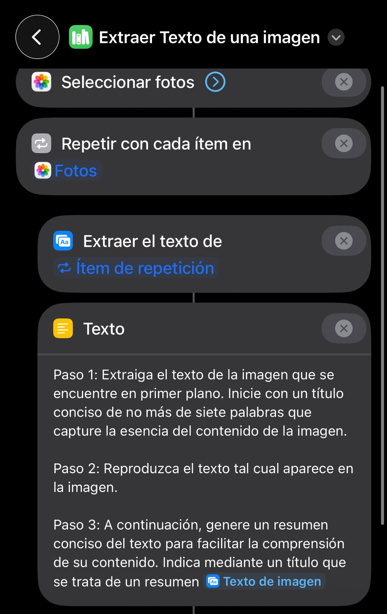

# 📄 Extraer texto de imagen

Extrae texto desde una o varias imágenes, lo procesa con IA y guarda el resultado automáticamente en Notas.

---

  

---

## 🧠 ¿Para qué sirve?

Este atajo te permite:

- Extraer texto de imágenes automáticamente  
- Generar un resumen del contenido  
- Guardar la información procesada en Notas  
- Evitar copiar texto manualmente  

Ideal para documentos, capturas, tickets o cualquier imagen con texto.

---

## ⚙️ Requisitos

- 📱 iOS actualizado  
- 📲 App Atajos  
- 🤖 Acceso a ChatGPT (OBLIGATORIO)

👉 Se utiliza IA para mejorar el resultado del texto extraído.

---

## 📲 Instalación

1. Descarga el atajo:  
   🔗 https://www.icloud.com/shortcuts/3feefabac3864d6b8b748a3fc32d71db

2. Ábrelo en la app **Atajos**

---

## ▶️ Uso

1. Ejecuta el atajo  
2. Selecciona una o varias imágenes  
3. El sistema procesa automáticamente el contenido  

👉 El resultado se guarda en Notas

---

## 📂 ¿Qué hace internamente?

El atajo:

1. Permite seleccionar una o varias imágenes  
2. Extrae el texto de cada imagen  
3. Procesa el contenido con ChatGPT:
   - Genera un título  
   - Mantiene el texto original  
   - Crea un resumen  
4. Combina todos los resultados  
5. Guarda el contenido en una nota  

---

## 📂 Resultado

Se crea una nota dentro de la app **Notas** con el contenido procesado.

👉 La nota incluirá:
- 🏷️ Título generado automáticamente  
- 📄 Texto original de la imagen  
- 🧠 Resumen del contenido  

---

## ⚠️ Problemas comunes

- ❌ No detecta texto → revisa calidad de la imagen  
- ❌ Resultado incorrecto → prueba con otra imagen más clara  
- ❌ No funciona → revisa acceso a ChatGPT  
- ❌ No se crea la nota → revisa permisos de la app Notas  

---

## 💡 Notas

- Funciona mejor con texto claro y legible  
- Puedes seleccionar varias imágenes a la vez  
- El resultado depende de la calidad del texto original  
- El resumen es generado por IA, puede variar  
- Puedes adaptar el prompt de ChatGPT a tus necesidades  
