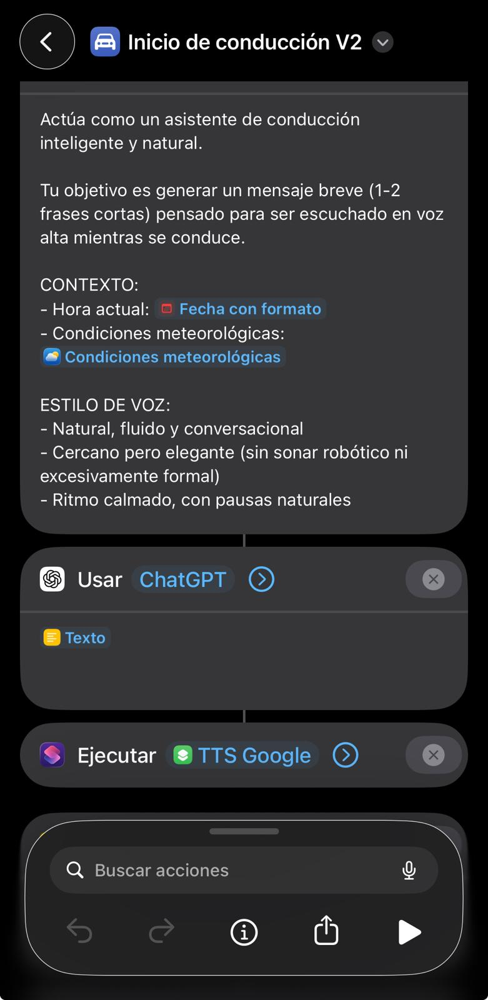
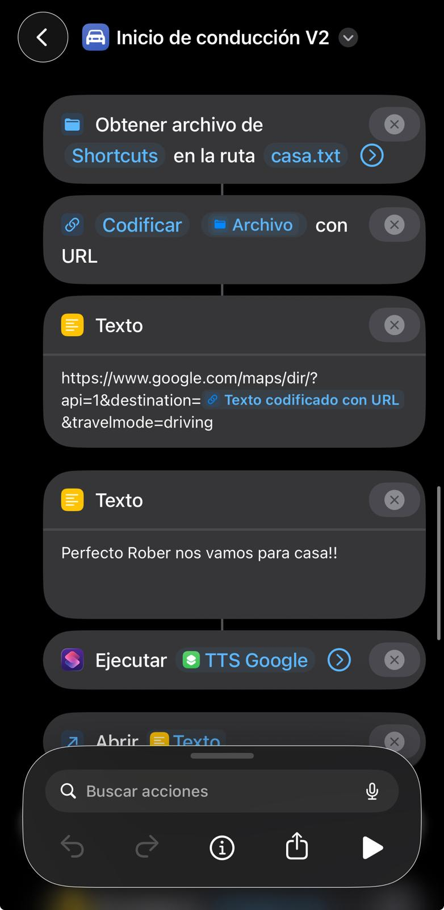

# 🚀 Inicio de conducción V2 (IA + Voz)

Asistente de conducción inteligente que genera mensajes dinámicos y los reproduce con voz natural al iniciar la marcha.

---

  

---

## 🧠 ¿Para qué sirve?

Este atajo te permite:

- Recibir un mensaje de bienvenida dinámico al entrar en el coche  
- Escuchar una voz natural en lugar de la voz robótica de iOS  
- Interactuar para iniciar navegación sin tocar el móvil  
- Tener una experiencia más cercana a un asistente real  

Ideal para uso diario y conducción manos libres.

---

## ⚙️ Requisitos

- 📱 iOS actualizado  
- 📲 App Atajos  
- 🌐 Conexión a internet  
- 🔗 Dependencias (OBLIGATORIO):
  - 🔊 TTS Google  
- 🔗 Dependencias (recomendado):
  - 🏠 Configurar casa  

👉 Este atajo utiliza IA y un sistema de voz externo.

---

## 📲 Instalación

1. Descarga el atajo:  
   🔗 https://www.icloud.com/shortcuts/1b99ccca2ec248c2b5d80131bd84a045

2. Ábrelo en la app **Atajos**

---

## ▶️ Uso

Este sistema no se ejecuta manualmente.

Funciona automáticamente al conectarte al coche.

---

## 🤖 Automatización

Configura una automatización en iOS:

1. Abre **Atajos → Automatización**  
2. Pulsa **Crear automatización personal**  
3. Selecciona:
   - 🚗 **CarPlay → Se conecta**  
   *(o Bluetooth del coche)*  
4. Añade acción:
   - Ejecutar atajo  
   - Selecciona: **Inicio de conducción V2**  
5. Desactiva:
   - ❌ "Solicitar confirmación"  
6. Guardar  

---

## 📂 ¿Qué hace internamente?

El atajo:

1. Detecta que te conectas al coche  
2. Genera un mensaje dinámico con IA  
3. Envía el texto al sistema TTS Google  
4. Reproduce el mensaje con voz natural  

  

5. Solicita un destino por voz  
6. Interpreta la respuesta:
   - “no” → cancela  
   - “casa” → usa tu ubicación guardada  
   - otro destino → lo procesa automáticamente  

7. Abre Google Maps con la ruta  

  

---

## 🔊 Sistema de voz (clave)

Este atajo utiliza un sistema desacoplado de voz:

- 🤖 Generación de texto → ChatGPT  
- 🔊 Reproducción de audio → TTS Google  

👉 Esto permite:

- Voz más natural  
- Mejor entonación  
- Mayor flexibilidad  

---

## 🏠 Uso de “casa”

Cuando dices “llévame a casa”:

- El atajo lee el archivo configurado previamente  
- Utiliza esa ubicación como destino  
- Inicia la navegación automáticamente  

👉 Depende del atajo **Configurar casa**

---

## ⚠️ Problemas comunes

- ❌ No se reproduce audio → revisa TTS Google  
- ❌ No reconoce la voz → revisa permisos de micrófono  
- ❌ No abre navegación → revisa Google Maps instalado  
- ❌ “Casa” no funciona → ejecuta de nuevo Configurar casa  
- ❌ No se ejecuta → revisa la automatización  

---

## 💡 Notas

- Funciona mejor con CarPlay  
- Compatible con Bluetooth del coche  
- Requiere conexión a internet  
- El mensaje generado puede variar en cada ejecución  
- Puedes personalizar el comportamiento modificando el prompt  

---

## 🔗 Versión básica

Si prefieres una versión sin IA ni dependencias externas:

👉 📂 [Inicio conducción (básico)](../inicio-conduccion/README.md)
