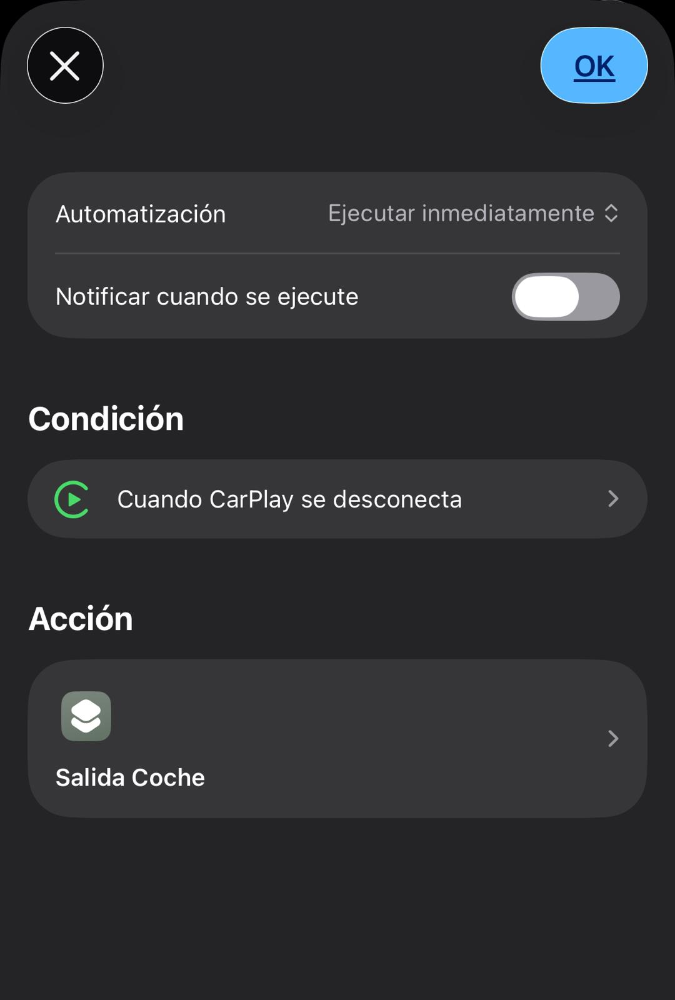
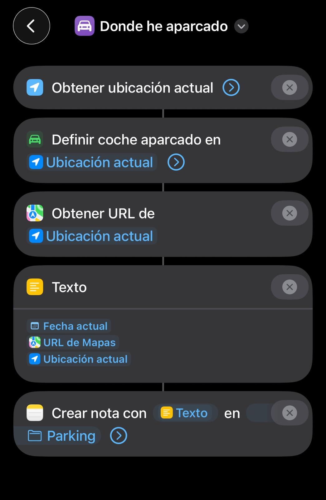

# 🚗 Salida coche

Automatización inteligente que detecta cuándo sales del coche y guarda automáticamente la ubicación de aparcamiento solo si estás lejos de casa.

---

## 🧠 ¿Para qué sirve?

Este atajo te permite:

- Guardar automáticamente dónde has aparcado  
- Evitar guardar ubicaciones innecesarias en casa  
- Automatizar completamente el proceso sin intervención  

👉 Es la versión inteligente del atajo **Dónde he aparcado**

---

## ⚙️ Requisitos

- 📱 iOS actualizado  
- 📲 App Atajos  
- 🔗 Dependencias (OBLIGATORIO):
  - 🏠 Configurar casa  
  - 📍 Dónde he aparcado  

👉 Debes haber configurado previamente tu ubicación de casa.

---

## 📲 Instalación

1. Descarga los atajos necesarios:  

   - 🔗 https://www.icloud.com/shortcuts/f891d200ea1645fcb1d631d1a5df6f27  
   - 🔗 https://www.icloud.com/shortcuts/3099be7701d8499cb034e1cd9902ec14  

2. Ábrelos en la app **Atajos**

---

## ▶️ Uso

Este atajo no se ejecuta manualmente.

👉 Se lanza automáticamente mediante una automatización de iOS.

---

## 🤖 Automatización

Configura una automatización en iOS:

1. Abre **Atajos → Automatización**  
2. Pulsa **Crear automatización personal**  
3. Selecciona:
   - 🚗 **CarPlay → Se desconecta**  
   *(o Bluetooth del coche)*  
4. Añade acción:
   - Ejecutar atajo  
   - Selecciona: **Salida coche**  
5. Desactiva:
   - ❌ "Solicitar confirmación"  
6. Guardar  

💡 Recomendado: activa "Ejecutar inmediatamente" para evitar confirmaciones.

---

### 📱 Ejemplo de automatización

  

---

## 🧠 Lógica del atajo

Este es el flujo interno del sistema:

  

---

## 📂 ¿Qué hace internamente?

El atajo:

1. Detecta que has salido del coche  
2. Obtiene tu ubicación actual  
3. Lee la ubicación de casa (archivo `casa`)  
4. Calcula la distancia entre ambas  
5. Evalúa la distancia:
   - Si estás lejos de casa → ejecuta **Dónde he aparcado**  
   - Si estás cerca → no hace nada  

---

## 📏 Lógica de distancia

El atajo solo actúa si estás lo suficientemente lejos de casa.

- Valor recomendado: `0.3 km` (300 metros)  

👉 Puedes ajustarlo según tus necesidades.

Esto evita guardar ubicaciones cuando estás en casa.

---

## ⚠️ Problemas comunes

- ❌ No se ejecuta → revisa la automatización  
- ❌ No guarda ubicación → revisa permisos de ubicación  
- ❌ No funciona “casa” → ejecuta de nuevo Configurar casa  
- ❌ Archivo `casa` incorrecto → revisa nombre y ubicación  

---

## 💡 Notas

- Funciona mejor con CarPlay  
- Compatible con Bluetooth del coche  
- Reutiliza lógica de otros atajos  
- Puedes añadir notificaciones o acciones extra  

---

## 🔁 Relación con otros atajos

Este atajo depende de:

- 🏠 **Configurar casa**  
- 📍 **Dónde he aparcado**  

👉 Forma parte del sistema de automatización de coche
