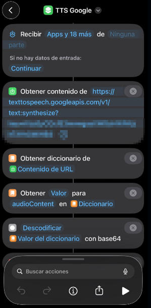

# 🔊 TTS Google (voz natural)

Convierte texto en voz natural usando Google Cloud Text-to-Speech integrado en Atajos de iOS.

---

  

---

## 🧠 ¿Para qué sirve?

Este atajo te permite:

- Reproducir texto con una voz mucho más natural que iOS  
- Mejorar la experiencia de automatizaciones con audio  
- Integrar voz real en cualquier atajo  
- Reutilizar un sistema TTS en todo el proyecto  

Ideal para asistentes, notificaciones y automatizaciones por voz.

---

## ⚙️ Requisitos

- 📱 iOS actualizado  
- 📲 App Atajos  
- 🌐 Conexión a internet  
- 🔗 Cuenta de Google Cloud (OBLIGATORIO)

👉 Necesitas configurar una API de Google para usar este sistema.

---

## 📲 Instalación

1. Descarga el atajo:  
   🔗 [(añadir enlace iCloud)](https://www.icloud.com/shortcuts/2b97d1ff3b7a4e76be6e98baf7992a82)

2. Ábrelo en la app **Atajos**

---

## ▶️ Uso

Este atajo no se usa directamente.

Se ejecuta desde otros atajos pasando un texto como entrada.

---

## 🔁 Ejecución desde otro atajo

Para usarlo:

1. Añade acción:
   - Ejecutar atajo  
2. Selecciona:
   - **TTS Google**  
3. En **Entrada**:
   - Pasa el texto que quieras reproducir  

👉 Ejemplo:

“Iniciamos la ruta a Calle Mayor”

---

## 📂 ¿Qué hace internamente?

El atajo:

1. Recibe un texto como entrada  
2. Llama a la API de Google Text-to-Speech  
3. Recibe el audio en formato base64  
4. Convierte el audio a formato reproducible  
5. Reproduce el sonido automáticamente  

---

## ⚙️ Configuración de Google (IMPORTANTE)

Para que funcione, debes configurar la API:

### 1️⃣ Crear proyecto

- Accede a: https://console.cloud.google.com/  
- Crea un nuevo proyecto  

---

### 2️⃣ Activar API

- Busca: **Text-to-Speech**  
- Activa la API  

---

### 3️⃣ Crear API Key

- Ve a **Credenciales**  
- Crear credencial → API Key  
- Copia la clave  

---

### 4️⃣ Añadir método de pago

👉 Google lo solicita para activar la API

💡 Pero:

- Tiene un nivel gratuito amplio  
- Para uso personal no suele generar coste  
- Puedes limitar el consumo desde Google Cloud  

👉 Tú decides si quieres usarlo o no

---

### 5️⃣ Configurar el atajo

En la acción:

**Obtener contenido de URL**

Añade: https://texttospeech.googleapis.com/v1/text:synthesize?key=TU_API_KEY

---

## ⚠️ Problemas comunes

- ❌ No se reproduce audio → revisa API Key  
- ❌ Error en la llamada → revisa JSON del body  
- ❌ Sonido raro → revisa decodificación base64  
- ❌ No funciona → revisa conexión a internet  

---

## 💡 Notas

- Usa frases cortas para mejor resultado  
- Añade pausas con “...” para naturalidad  
- Evita textos demasiado largos  
- La voz es configurable (idioma y tipo)  

---

## 🔐 Privacidad

- El texto se envía a Google para generar el audio  
- No se almacena información en el dispositivo  
- No se comparten datos con terceros adicionales  

---

## 🚀 Resultado

Una voz natural integrada en cualquier automatización de iOS.

